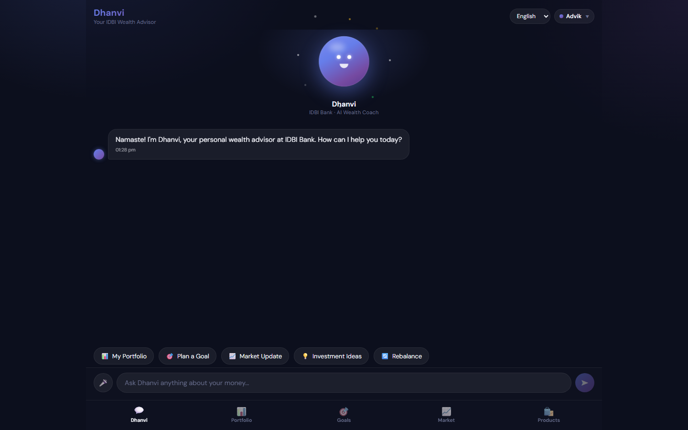
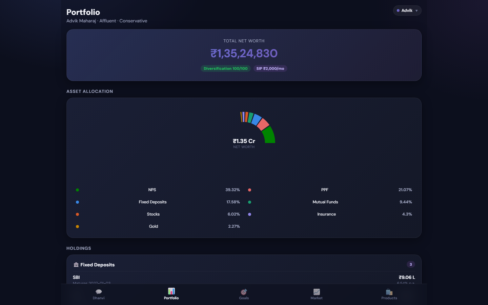
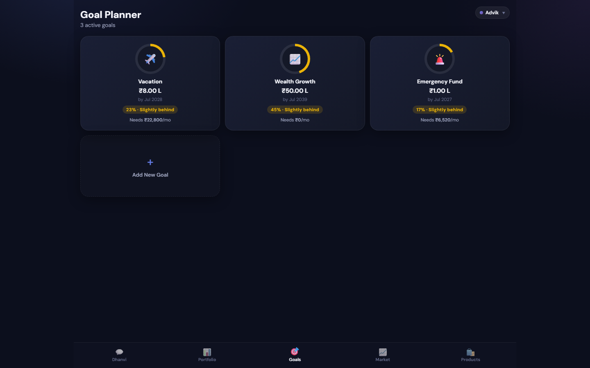
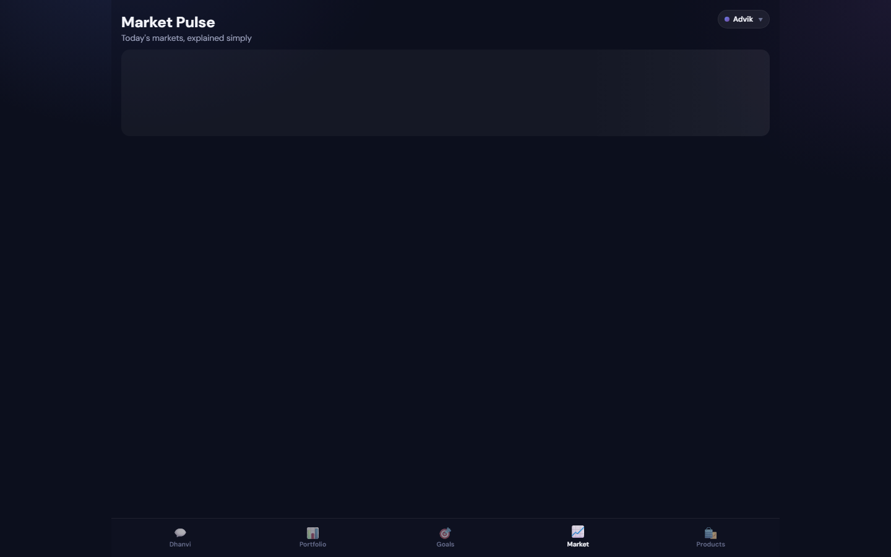
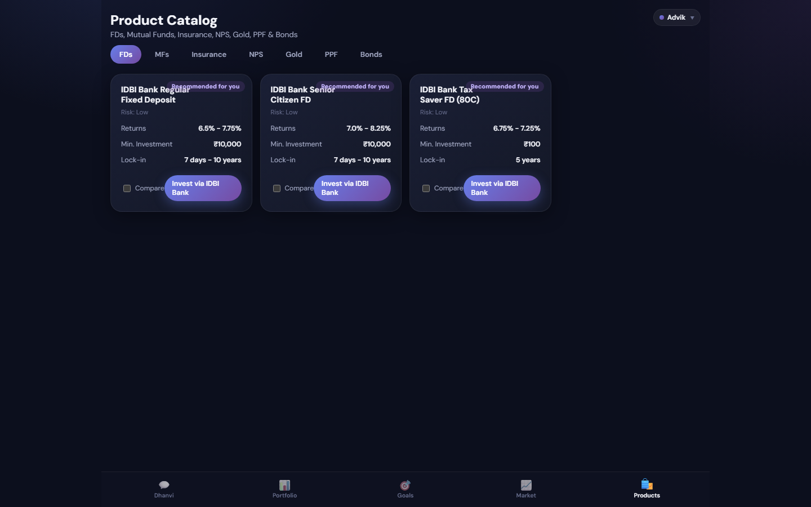
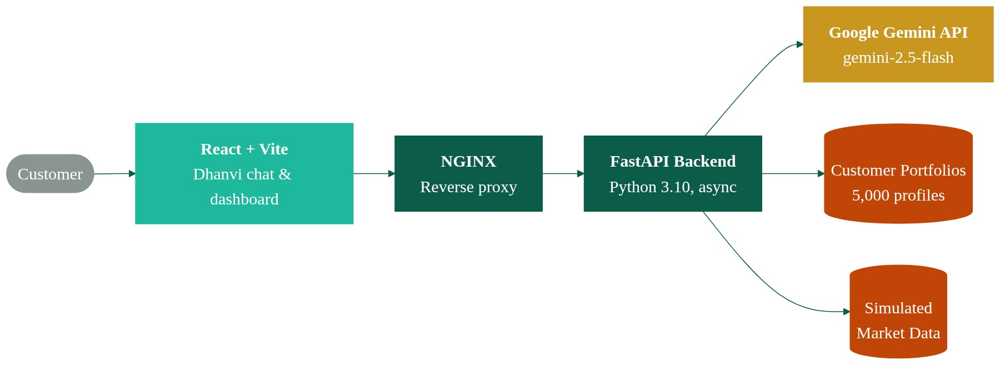

# PS1 — Digital Wealth Management: Dhanvi


A hackathon submission (IDBI Innovate 2026) for **PS1 — Digital Wealth
Management**: "Dhanvi," a conversational AI wealth advisor paired with a
rule-based financial engine, built around IDBI's stated goal of a **hybrid
AI + human-Relationship-Manager** advisory model.

> **This is a hackathon proof-of-concept with entirely synthetic data.** Read
> [`DISCLAIMER.md`](./DISCLAIMER.md) before evaluating this as anything more
> than that.

## Why this exists

IDBI's brief for PS1 asked for a digital wealth advisor that can talk to mass
and affluent customers about their money in plain language, recommend
concrete schemes (not just abstract asset classes), and — critically — know
when to hand a conversation off to a human. Pure chatbot advice doesn't
satisfy SEBI suitability norms for regulated products (insurance, specific
new mutual fund purchases), and pure human-RM coverage doesn't scale to a
mass-market customer base. Dhanvi is built around that split: an LLM handles
the natural, personalized conversation and vanilla/non-regulated guidance
(FDs, SIPs into existing schemes, PPF, NPS), while anything regulated,
legally complex, or explicitly requested by the customer is flagged and
routed to a real IDBI Relationship Manager through an in-app hand-off flow.

## Key features

Everything below is verifiable directly in this codebase, not aspirational:

- **Conversational AI advisor ("Dhanvi")** — `backend/advisory/engine.py`
  builds a system prompt grounded in the customer's actual synthetic
  portfolio (net worth, goals, mutual funds, insurance, NPS/PPF balances)
  and calls a DeepSeek LLM for the reply. If no API key is configured, every
  endpoint still returns a clear, non-crashing response (`ai_powered: false`)
  instead of a 500.
- **Real hybrid AI-to-human hand-off** — `frontend/src/components/EscalationBanner.jsx`
  renders a "Connect RM" hand-off card whenever `detect_escalation()` (keyword
  + regex matching on things like "estate plan," "insurance claim,"
  "mis-sold," or an explicit request for a human) fires, and `POST /escalate`
  creates an in-memory ticket assigned to a mock RM with a 24-hour SLA.
- **Multi-language, not just cosmetic** — the system prompt literally
  instructs the model `Respond in {language}`, and the UI lets a customer
  pick from six languages (English, Hindi, Tamil, Telugu, Bengali, Marathi).
  Switching language changes the actual AI output, not just static UI labels.
- **Voice input and partial voice output** — `AvatarChat.jsx` uses the
  browser's Web Speech API for voice-to-text input, and a self-hosted Piper
  TTS engine (`backend/advisory/tts_engine.py`) speaks Dhanvi's replies back
  for English and Hindi (see Known Limitations for the other four languages).
- **Deterministic pre-LLM safety guardrail** — `assess_input_safety()` in
  `backend/advisory/engine.py` screens every chat message with a regex bank
  plus Jaccard word-set similarity against known jailbreak phrasings,
  entirely in Python's standard library, before the message ever reaches the
  DeepSeek API. A hard-blocked message gets a canned refusal instead of an
  LLM call.
- **Rule-based financial engine, independent of any LLM** —
  `backend/advisory/finance.py` computes goal-based SIP requirements
  (annuity-due formula, 3 return scenarios), a 10-question suitability
  questionnaire and risk-profile score, portfolio-gap-driven product
  recommendations, and 50/30/20 spending insights — all deterministic and
  testable without any API key.
- **Named, scheme-specific product recommendations** — `Products.jsx` and
  `PRODUCT_CATALOG` in `app/main.py` list real scheme-style products (e.g.
  "IDBI Focused Equity Fund," "IDBI Bank Senior Citizen FD") with risk,
  return range, minimum investment, and lock-in, flagged `recommended_for_you`
  against the customer's risk profile — not just generic asset-class buckets.
- **5,000 synthetic customer profiles** — `backend/scripts/generate_data.py`
  generates realistic (fictitious) Indian customer demographics, portfolios,
  goals, and 6 months of transaction history using `Faker`, seeded for
  reproducibility.

## Screenshots

| Home / Avatar Chat | Portfolio |
|---|---|
|  |  |

| Goals | Market Pulse |
|---|---|
|  |  |

| Products |
|---|
|  |

## Architecture



- **Frontend**: React 19 + Vite, client-side routed (React Router) across 5
  pages — Avatar Chat, Portfolio, Goals, Market, Products — talking to the
  backend over a configurable `VITE_API_URL`.
- **Backend**: FastAPI (Python 3.11), a single service exposing chat,
  portfolio, suitability, goal-plan, recommendations, market-pulse, insights,
  TTS, and escalation endpoints. No database — customer data is loaded from a
  generated JSON file into memory at startup.
- **LLM**: DeepSeek (`deepseek-v4-flash` by default), called only for the
  conversational endpoints (`/chat`, market commentary, spending tips); every
  other endpoint is pure Python and works without it.
- **Voice**: browser Web Speech API for speech-to-text input; a self-hosted
  Piper ONNX model for text-to-speech output (English + Hindi).

## How to run locally

### Backend (FastAPI)

Requires Python 3.11.

```bash
cd backend
py -3.11 -m venv venv
./venv/Scripts/pip install -r requirements.txt      # venv/bin/pip on macOS/Linux

# Generate the 5,000 synthetic customer profiles (writes data/customers.json)
./venv/Scripts/python scripts/generate_data.py

# Add your DeepSeek key (optional — the API runs and degrades gracefully without one)
cp .env.example .env
# then edit backend/.env and set DEEPSEEK_API_KEY=<your key>

./venv/Scripts/python -m uvicorn app.main:app --reload --port 8003
```

API docs: http://127.0.0.1:8003/docs

Run the test suite:

```bash
./venv/Scripts/python -m pytest tests/ -v
```

### Frontend (React + Vite)

Requires Node.js.

```bash
cd frontend
npm install
cp .env.example .env   # defaults to VITE_API_URL=http://localhost:8003
npm run dev
```

Dev server: http://localhost:5176

## Known limitations

| Area | Limitation |
|---|---|
| Input safety | `assess_input_safety()` is regex + Jaccard-similarity heuristic matching, not a trained classifier — it can miss novel/obfuscated jailbreak attempts and is not a substitute for a real moderation layer. |
| Escalation detection | Keyword/regex-based (`detect_escalation()`); a paraphrased sensitive request can slip through without triggering the RM hand-off. |
| Audit trail | Escalation tickets and chat activity live only in server process memory and `backend/server.log` — nothing is persisted to a database. |
| Authentication | There is no login, session, or access-control layer — any client can query any synthetic `customer_id`. |
| Voice output | Piper TTS only has voice models for English and Hindi; the other 4 supported UI languages get text replies only. |
| Cross-institution data | Suitability/recommendations use only the synthetic IDBI-side portfolio; there's no way to factor in holdings at other banks. |
| Mobile responsiveness | Only 3 of the frontend's 16 CSS files (`index.css`, `BottomNav.css`, `GoalDetailModal.css`) contain any `@media` query — most pages have not had a dedicated mobile-responsive pass. |
| Data | All customer, portfolio, and market data is synthetic (`Faker`-generated); no real financial data is used anywhere. |

See [`DISCLAIMER.md`](./DISCLAIMER.md) for the full, unabridged version.

## Next phase / roadmap

- **Full voice parity.** Extend the self-hosted Piper TTS voice set beyond
  English and Hindi to cover Tamil, Telugu, Bengali, and Marathi, so Dhanvi
  can speak in every language the chat UI already supports — and improve the
  Web Speech API voice-input language mapping to match (it currently only
  distinguishes English vs. Hindi recognition locales).
- **Bhashini integration.** Move multilingual text and speech handling onto
  India's national Bhashini language stack rather than relying solely on the
  LLM's own multilingual ability and a hand-picked speech recognition/voice
  set, for broader and more consistent Indian-language coverage.
- **Cross-institution holdings visibility.** Integrate Account Aggregator
  (AA) consent flows so suitability scoring and recommendations can account
  for what a customer holds at other banks and brokers, not just IDBI.
- **Tighter vanilla-vs-regulated product gating.** Turn the current
  ad hoc/prompt-level distinction between "AI can answer directly" and "this
  needs RM/SEBI sign-off" into an explicit, auditable rule set rather than
  something the system prompt is merely told to honor.
- **Mobile-responsive pass.** Add `@media` breakpoints across the remaining
  frontend pages/components — most of the app has not yet had a dedicated
  mobile layout pass, which matters given IDBI's stated "mobile-first,
  integrate with the bank's app" direction for this problem statement.
- **Persistent audit trail.** Move escalation tickets and safety-guardrail
  triggers from in-memory/log-file storage to a real database, so compliance
  and RM teams can query history after a restart.
